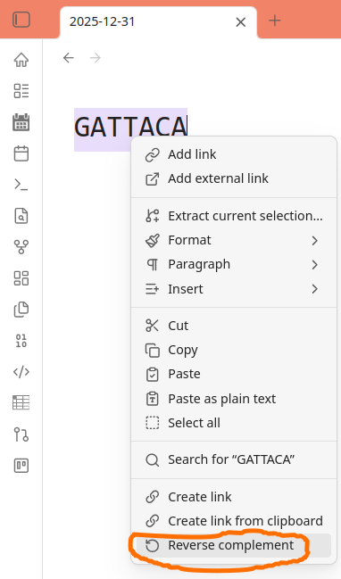

# Obsidian Reverse Complement Plugin

This is a plugin that adds a reverse complement function to obsidian.




This plugin was made following these [instructions](https://docs.obsidian.md/Plugins/Getting+started/Build+a+plugin).


# How to make a release

Create a local tag that matches the version in the manifest.json file.

```bash
git tag -a 1.0.1 -m "1.0.1" # tag and name has to be the same
git push origin 1.0.1
```

-a creates an annotated tag.
-m specifies the name of your release.

When the workflow finishes, Publish the newly created draft release.
